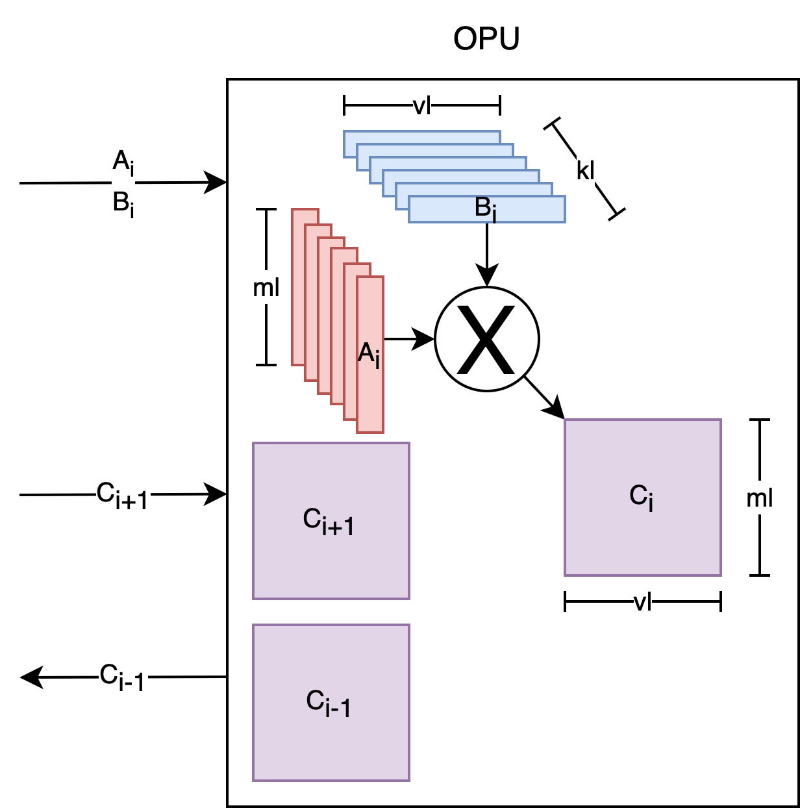
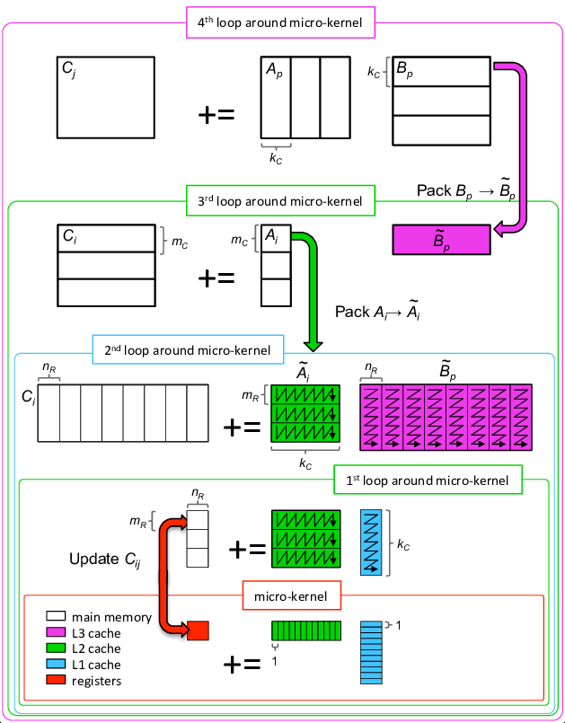
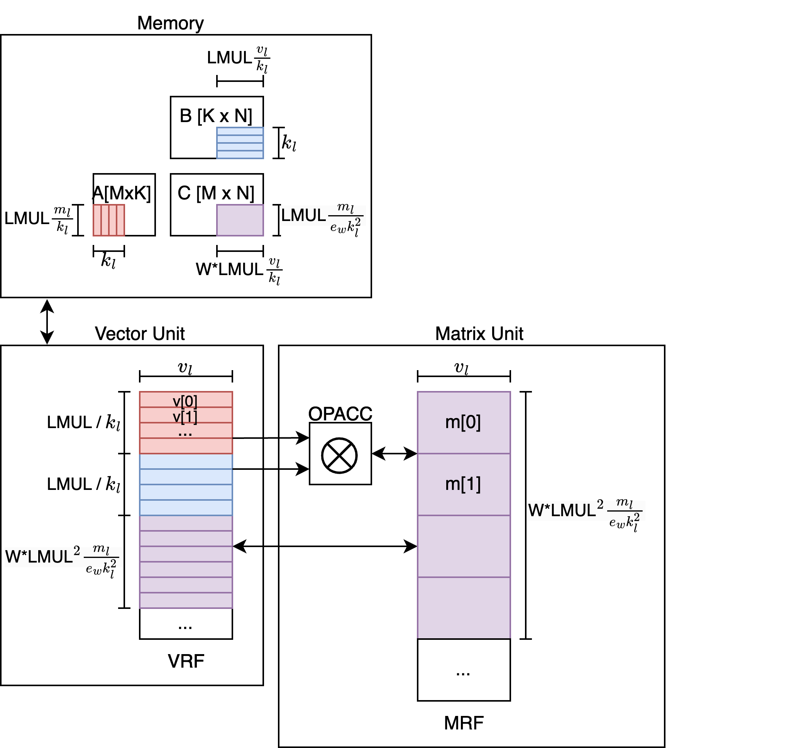

## Introduction

Performance model of matrix multiplication architecture. For now, the functional unit computes the outer product GEMM kernel

$C_{M,N} = A_{M,K} * B_{K,N} = \sum_i A_{M,i} \times B_{i,N}$.

We would like to characterize how architectural parameters such as number and size of matrix registers, supported datatype, scalability of register dimensions, instructions, etc, affect performance metrics such as kernel latency, throughput (operations per cycle), and required bandwidth of memory and matrix register file, and cache size to maximize throughput.

We also explore the sensitivity of these performance metrics to software parameters such as matrix dimensions.

In the future we plan to use RTL simulation to see how these performance metrics are reduced when cache size and memory bandwidth to not meet these requirements. 

## Functional Unit Layout

A a two dimensional grid of registers and multiply-accumulate (macc) units, stores partial products of a subset, or tile, of the output matrix, $C_i = A_{M,i} \times B_{i,N}$. A mesh of wires connects the macc units to columns of A and rows of B. This outer-product-centric approach to accelerating GEMM kernels encourages C to be held in accumulation registers distributed with the MACC units.


Fig 1. Physical Layout of Outer Product


The outer product unit (OPU) can execute $NM$ MACC operations per cycle, and requires $N+M$ elements loaded from memory. For a machine with vector length $vl=N=M$, the OPU performance scales as $NM=vl^2$ MACCs per cycle, so performance scales quadratically with the vector length.

The architecture provides loading tiles of A, B and C, and performing outer-product-accumulate on C.



## GEMM Outer Product Kernel

Linear algebra libraries decompose large GEMMs into micro-kernels, such as the output stationary outer product kernel below:



Decomposition of GEMM into Outer Product Micro-Kernels [1]. 
where the register and cache tile dimensions $n_r$, $m_r$, $k_c$ correspond to our model parameters like so: $n_r=v_l$, $m_r = m_l$

The micro kernel at the bottom of the above figure can be written as follows:  
```
mat c = mld(C[m:mr, n:nr]);
for (int k = 0; k < kc;  k ++) {
    mat a = mld(A[k]);
    mat b = mld(B[k]);
    c = opacc(c, a ,b)
}
```
and has a OPI=$v_l$.

The first loop utilizes all of the MRF tile registers by performing one micro-kernel for each tile register:
```
for (int m = mo; m < mo+mc; m += mr) {
    mat b = mld(B[k:kl,n:nr]);
    for (int k = ko; k < ko+kl;  k += kl) {
        mat a = mld(A[m:mr,ko:kl]);
        mat c = mld(C[m:mr, n:nr]);
        c = opacc(c, a ,b)
}   }
```
this increases the accumulator storage to $m_c v_l$ where $m_c$ is the storage available using all tile registers. Now OPI=$\frac{k_c m_c v_l}{k_c(m_c+v_l)}=\frac{m_c v_l}{m_c+v_l}$. If there are an even number of tile registers, the OPI can be increased by forming a 2x$\frac{m_c}{2}$ (instead of a 1x$m_c$ ash shown in the 1st loop of the above figure). For example, with $4n_r$ tile registers we can form a $2 n_r v_l$ x $2 n_r v_l$ tile of C, acheiving OPI = $n_r v_l$.

Similarly, the outermost loops increase OPI due to reuse of tiles of A out of the L2 cache and tiles of B out of the L3 cache:
```
for (int ko = 0; ko < K; ko += kc) {
    // L3$ prefetch B[ko:kc,0:N]
    for (int mo = 0; mo < M; mo += mc) {
        // L2$ prefetch A[mo:mc,ko:kc]
        for (int n = 0; n < N; n += nr) {
            nr = vsetvl(n);
            // L2$ prefetch C[mo:mc,n:nr]
            for (int m = mo; m < mo+mc; m += mr) {
                mr = msetml(m);
                mat a = mld(A[m:mr,ko:kl]);
                mat c = mld(C[m:mr, n:nr]);
                for (int k = ko; k < ko+kl;  k += kl) {
                    kl = msetkl(k);
                    mat b = mld(B[k:kl,n:nr]);
                    c = opacc(c, a ,b)
            }   }
            mst(c, C[m:, n:]);
}   }   }
```
where `mld` and `mst` move matrix tiles into and out of the matrix registers within the outer product unit (note `mld` and `mst` need the unit-stride dimension of the matrix in memory to compute the stride between vector rows). A scalable dimension `ml` has been added to allow the number of vector rows held in the OPU to vary across machines.

The micro-kernel is computed by calling the `opacc` instruction $k_c$ times, as shown in the above Fig. The $k_c$ iterations of micro-kernel can be reduced by introducing the parameter $k_l$, which is the number of accumulates per outer product instruction. Now A and B are tiles with inner dimension $k_l$, stored in local matrix or vector registers.

If the K dimension is sufficiently small, we can store tiles $A[m_c \times K]$, $B[K \times n_c]$, and $C[m_c \times n_c]$ in cache. This allows us to choose a schedule that maximizes C-tile re-use, by moving K to the innermost loop (essentially reducing our BLAS schedule to the 2nd loop around the micro-kernel):
```
for (int mo = 0; mo < M; mo += mc) {
    // L2$ prefetch A[mo:mc,:]
    for (int n = 0; n < N; n += nr) {
        nr = vsetvl(n);
        mat c = mzero(mc, nr);
        for (int ko = 0; ko < K; k += kc) {
            for (int m = mo; m < mo+mc; m += mr) {
                mr = msetml(m);
                mat a = mld(A[m:mr,ko:kl]);
                for (int k = ko; k < ko+kl;  k += kl) {
                    kl = msetkl(k);
                    mat b = mld(B[k:kl,n:nr]);
                    c = opacc(c, a ,b)
            }   }
        mst(c, C[m:, n:]);
}   }   }
``` 
For a 512KB L2 cache this would occur with square matrix dimensions of around 256 Bytes. For a 4MB L3 cache this would occur for dimensions around 1KB. Holding larger C-tiles in cache improves the reuse of DRAM loads.

In the inner loop of this output stationary dataflow, $N+M$ vector elements are loaded and $NM$ MACC operations are performed. For a machine with vector length $vl=N=M$, the fraction of compute operations to memory accesses, or operational intensity, increases with the vector length of the machine, $OI = \frac{NM}{N+M}=vl$.

Scaling $vl$ is limited in part by available register and cache capacity required to stage the next set of outer products such that the functional unit is fully utilized.

## GEMM Dataflows

First, consider GEMM with small matrix dimensions, where A, B, and C all fit in the cache. Tiles of A, B, and C are held in matrix registers. The matrix r

To hide memory latency $t_{ld}$, $p_{mem}$ threads must send memory load requests in parallel, requiring $p_{mem}$ matrix tile registers to receive the load data. A cache can be used to buffer data loaded for the next batch of GEMMs and data to be stored from the last batch of GEMMs.



If the C matrix is small enough to fit in an matrix register, then the parallel memory requests must come from independent threads, and the only opportunity for memory data reuse is in the K-dimension, because tile C will be reused K times. 

### Operation Latency

The latency of an outer product micro-kernel, $t_{\mu k}$ depends on micro architecture decisions such as number of read and write ports between the cache and matrix register file. 

Assuming there is sufficient buffering and communication bandwidth to overlap the outer product computation with loading and storing tiles of C, the minimum possible latency is 

$t_{\mu k} = k_c$

which requires the load bandwidth between the cache and matric register file (mrf) to be,

$BW_{mrf} = \frac{k_c(m_l+v_l)+m_l v_l}{k_c}$

to load the A and B tiles for current OPACC as well as the C tile for the next micro-kernel. 
It is also possible to reduce the required bandwidth by reducing the macc operations per cycle and thus increasing the operation latency.

Future work is to build a matrix unit generator in RTL to find cycle-accurate latency over many micro-architecture parameters. 

### Memory Latency

Here is an example of a simple single-threaded schedule:  
| time ->       | 0        | ... | tld-1             | tld           | ... | tld+k-1            |tld+k        |        |
|---------------|----------|-----|-----------------|-----------------|-----|------------------|--------|--------|
| instruction   | mld C0   | ... |                 |                 | ... |                  |        |        |
|               | vld A0   | vld A1 | ...         |                 | vld A_kc          |     |                  |        |
|               | vld B0   | vld B1 | ...         |                 | vld B_k          |     |                  |        |
|               |          |      | opacc C0 A0 B0 | opacc C0 A1 B1  | ... | opacc C0 Ak Bk   |        |        |
|               |          |      |                 |                 | ... |                  | mst C0 | ...    |


To keep the OPU fully utilized we need to request overlaping loads from memory. The  memory request for the next A B C tiles must complete by $t=t_{ld}+m_l+k$, thus a new memory request must be issued every k cycles. To provide register storage for all in-flight loads, we need a number of parallel overlapping loads equal to:

$p_{mem}=\frac{t_{ld}+m_l}{t_{\mu k}}=\frac{t_{ld}+m_l}{k_c}$


In this model we consider a range of memory latencies from local caches (1-5 cycles) to shared cache (20-50 cycles) to DRAM memory (100-300 cycles).

Worst case scenario, $p_{mem}\approx\frac{200}{4}=50$. To avoid implementing 50 matrix registers, data should be prefetched into a smaller cache. By prefetching into the L2 cache, number of registers for full throughput is roughly $p_{mem}\approx\frac{40}{4}=10$. L2 cache can be designed to have lower latency, allowing for even fewer registers.

If there are not enough registers to maintain full throughput for a given memory latency, utilization drops and can be expressed as:

$U_{op} = \frac{t_{opacc}}{t_{uk}} = \max(1, \frac{p_{mem} k_l}{t_{mem}+k_l})$ 

resulting in reduced operations per cycle, $U_{op}m_lv_l$

### Cache Capacity

Over one batch of $p_{mem}$ GEMMs, required cache capacity to fully utilize the OPU is

$p_{mem}(2C_t+A_t+B_t) = p_{mem}(2m_lv_l+m_lk_c+k_cv_l)$ elements,

where $v_l$, $m_l$, $k_c$, are the dimensions of tiles $C_t$, $A_t$, $B_t$.
In general, operational intensity is maximized when matrix tiles are square. If $v_l=m_l$, required cache capacity can be expressed as

$c_{L2} = p_{mem}(2m_l+2k_c)$ vectors of length $v_l$.

## Memory Bandwidth

Over one batch of $p_{mem}$ GEMMs,required memory bandwidth, is 

$BW_{mem} =  \frac{c_{L2}}{t_{\mu k}} = \frac{m_l+k_c}{k_c}$ vector loads per cycle,

### Bandwidth for Large K Dimension

Now we see that is K is large, we acheive low bandwidth in addition to high operational intensity:

$BW_{mem} \approx 1$ vector load per cycle.

In this ideal case, the cache simply needs to buffer the next A and B tiles that will be used to accumulate C, and the overhead of loading and storing C tiles is negligible.

### Large M and N Dimensions

In general N and M are similar in size to K. If the dimensions N and M of matrices A B and C are sufficiently large, one tile of B can be reused for multiple C and A tiles, as shown in the first loop around the micro-kernel. This reduces the required cache capacity to

$c_{L2} = k_c(p_{mem}+1)$ vectors

and memory bandwidth to

$BW_{mem} = \frac{k_c(p_{mem}+1)}{k_cp_{mem}} = 1 + \frac{1}{p_{mem}}$ vectors per cycle.

### Bandwidth for Small K

GEMM with small K is more challenging because loading and storing C tiles begins to significantyly increase $t_{\mu k}$ and thus degrade operational intensity.

To support applications with small K, the cache can buffer tiles $C_{i-1}$ and $C_{i+1}$ and move them in and out of matrix registers. The required cache capacity becomes

$c_{L2} = 2p_{mem}(k_c + m_l)$ vectors 

and latency of the micro-kernel becomes

$t_{\mu k}=p_{mem}\max(k_c,m_l)$

Thus required memory bandwidth is

$BW_{mem} = \frac{2(k_c + m_l)}{\max(m_l, k_c)}$ vector loads per cycle,


## Usage

We have discussed some design points in which the performance metrics have simple expressions. This model estimates the performance metrics over arbitrary matrix dimensions K, M, N, datatype, number of matrix registers, and instruction parameters such as $v_l$, $m_l$, and $k_c$. The model also includes dependence on micro-architectural parameters such as cache size, buffering, etc.

For example usage, see jupyter notebooks (.ipynb)

## Reference
[1] F. G. Van Zee and T. M. Smith, “Implementing high-performance complex matrix multiplication,” ACM Transactions on Mathematical Software, 2016
